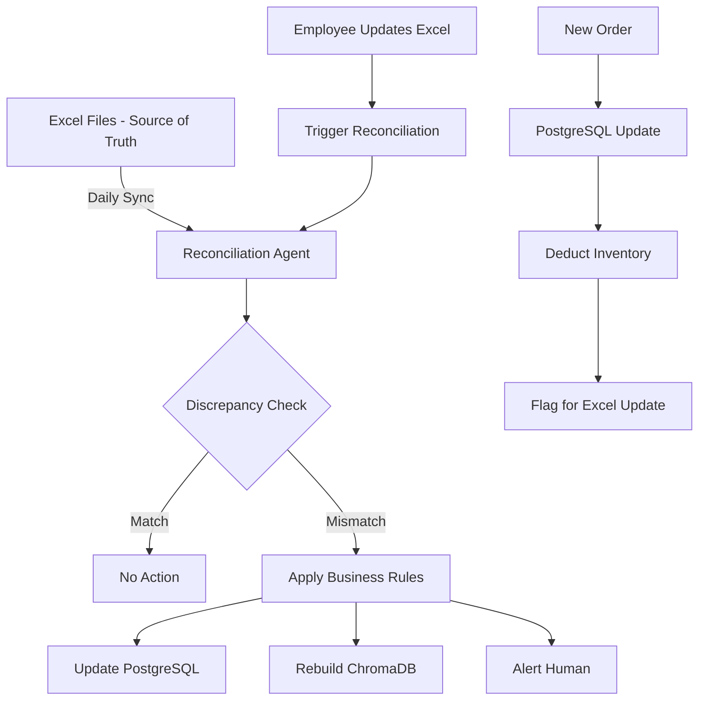

# Inventory Synchronization Strategy

## The Problem
- **Excel files** = Source of truth (maintained by employees daily)
- **ChromaDB** = Search engine (for RAG/semantic matching)
- **PostgreSQL** = Order processing & transactions

When discrepancies occur, we need clear rules on which source to trust.

## Data Flow Architecture



## Business Rules for Reconciliation

### Rule 1: Excel is Always Right (for total inventory)
```python
if excel_quantity != postgresql_quantity:
    if difference > 100:
        # Large discrepancy - human review needed
        alert_human("Large discrepancy detected")
    else:
        # Small discrepancy - auto-fix
        postgresql_quantity = excel_quantity
        log_adjustment("Auto-synced from Excel")
```

### Rule 2: PostgreSQL Tracks Real-Time Changes
```python
# When order is processed:
postgresql_quantity -= order_quantity
create_pending_excel_update(product_code, new_quantity)

# At end of day:
generate_excel_update_report()  # For employees to update Excel
```

### Rule 3: ChromaDB is Disposable
```python
# ChromaDB can always be rebuilt from Excel
if chromadb_out_of_sync:
    rebuild_chromadb_from_excel()  # No questions asked
```

## Practical Workflow

### Morning Sync (9 AM Daily)
1. Employee uploads updated Excel file
2. System runs reconciliation:
   ```python
   reconciliation = InventoryReconciliationAgent()
   report = await reconciliation.perform_reconciliation(
       excel_file_path="inventory/daily_stock.xlsx",
       auto_fix=True  # Auto-fix small discrepancies
   )
   ```

3. Handle results:
   - ✅ Small discrepancies (<100 units): Auto-synced
   - ⚠️ Large discrepancies (>100 units): Email sent to manager
   - 🔄 ChromaDB: Automatically rebuilt if needed

### During the Day (Order Processing)
```python
async def process_order(order):
    # 1. Check stock in PostgreSQL (real-time)
    current_stock = check_postgresql_stock(order.product_code)
    
    if current_stock >= order.quantity:
        # 2. Process order
        postgresql_stock -= order.quantity
        
        # 3. Create pending update for Excel
        pending_updates.add({
            'product_code': order.product_code,
            'deducted': order.quantity,
            'timestamp': now(),
            'order_id': order.id
        })
        
        # 4. Update ChromaDB metadata (optional)
        update_chromadb_metadata(order.product_code, current_stock - order.quantity)
    else:
        # Not enough stock - check Excel for recent updates
        excel_stock = check_latest_excel(order.product_code)
        if excel_stock > current_stock:
            # Excel has more - trigger immediate sync
            sync_from_excel(order.product_code)
```

### End of Day (5 PM)
```python
# Generate report for employees
report = generate_daily_report()
print(f"""
DAILY INVENTORY REPORT - {date.today()}
========================================
Orders Processed: {report.orders_count}

Items to Update in Excel:
-------------------------
Product Code    | Previous | Sold | Remaining
TBALWBL0009N   | 1000     | 200  | 800
TBALHGT0033N   | 500      | 50   | 450

Discrepancies Found:
--------------------
TBALTAG0363N: Excel shows 300, System shows 250
Action: Please verify physical stock

Please update the Excel file with these changes.
""")
```

## Handling Specific Scenarios

### Scenario 1: Order Count Different Between Sources
```python
Excel: TBALWBL0009N = 1000 units
PostgreSQL: TBALWBL0009N = 800 units
ChromaDB: TBALWBL0009N = 1000 units (outdated)

Resolution:
1. Check if 200 units were sold today (check orders)
2. If yes → Excel needs update → Generate report for employee
3. If no → PostgreSQL is wrong → Update from Excel
4. Always update ChromaDB to match final decision
```

### Scenario 2: Item Missing in PostgreSQL
```python
Excel: NEWITEM001 = 500 units
PostgreSQL: Not found
ChromaDB: Not found

Resolution:
1. Auto-add to PostgreSQL from Excel
2. Ingest into ChromaDB for search
3. Log: "New item added from Excel"
```

### Scenario 3: Emergency Stock Check
```python
# Customer wants 1000 units urgently
async def emergency_check(product_code, quantity):
    # 1. Check all sources in parallel
    excel_stock = await check_excel_async(product_code)
    pg_stock = await check_postgresql_async(product_code)
    
    # 2. Trust Excel if updated today
    if excel_last_updated == today():
        actual_stock = excel_stock
        if pg_stock != excel_stock:
            await sync_postgresql_from_excel(product_code)
    else:
        # Excel is old, check with employee
        actual_stock = await confirm_with_employee(product_code)
    
    return actual_stock >= quantity
```

## Implementation in Your System

### 1. Add Reconciliation to Daily Workflow
```python
# In run_factory_automation.py
async def daily_tasks():
    # Morning sync
    if current_time == "09:00":
        reconciliation_agent = InventoryReconciliationAgent(chromadb_client)
        report = await reconciliation_agent.perform_reconciliation(
            auto_fix=True
        )
        
        if report['summary']['actions_pending'] > 0:
            send_email_to_manager(report)
    
    # End of day report
    if current_time == "17:00":
        generate_excel_update_report()
```

### 2. Order Processing with Sync Check
```python
# In order_processor_agent.py
async def process_order_with_sync(self, order):
    # Check if sync needed
    last_sync = await get_last_sync_time(order.product_code)
    if (datetime.now() - last_sync).hours > 4:
        # Sync before processing
        await sync_product_from_excel(order.product_code)
    
    # Process order normally
    return await self.process_order(order)
```

### 3. Manual Sync Endpoint
```python
# In gradio_app.py
def sync_inventory(product_code: str = None):
    """Manual sync button for employees"""
    if product_code:
        # Sync specific item
        result = reconciliation_agent.sync_single_item(product_code)
    else:
        # Full sync
        result = reconciliation_agent.perform_reconciliation()
    
    return f"Sync complete: {result['summary']}"
```

## Key Principles

1. **Excel = Truth**: Employees maintain Excel, system follows
2. **PostgreSQL = Real-time**: Tracks live transactions
3. **ChromaDB = Cache**: Can be rebuilt anytime
4. **Human First**: When in doubt, ask employee
5. **Audit Everything**: Log all changes for accountability

## Alert Thresholds

- 🟢 **Auto-sync**: Discrepancy < 10 units
- 🟡 **Review**: Discrepancy 10-100 units  
- 🔴 **Alert**: Discrepancy > 100 units
- 🚨 **Critical**: Item missing entirely

This strategy ensures data consistency while respecting that employees manage the Excel files as the primary source of truth.